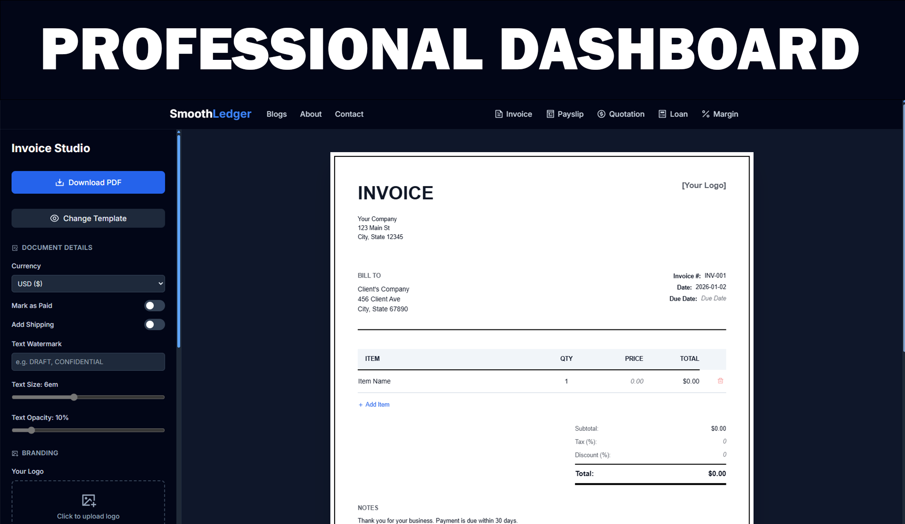
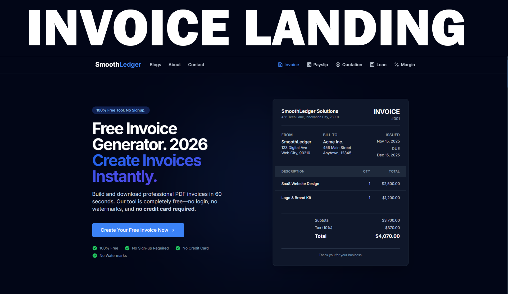
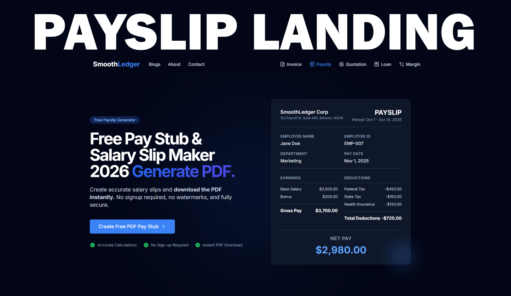

# SmoothLedger

<div align="center">

  

  <h3>
    <a href="https://smoothledger.com">Visit Live Site ↗</a>
  </h3>

  [](https://nextjs.org/)
  [](https://tailwindcss.com/)
  [](https://vercel.com/)
  [](https://opensource.org/licenses/MIT)

</div>

---

## About The Project

SmoothLedger is a suite of privacy-focused financial tools designed to remove friction for freelancers, contractors, and small business owners.

Most financial tools require users to create an account, verify their email, and navigate paywalls just to generate a simple document. SmoothLedger offers a different path: zero friction, client-side processing, and immediate utility.

### Core Philosophy

* **No Signup Required:** Users can generate professional documents instantly without handing over their email or creating an account.
* **Privacy First:** There is no database for user records. All data (clients, rates, templates) is stored locally in the user's browser via Local Storage. We never see or store financial data.
* **Performance:** Optimized for speed, with client-side PDF generation that happens in under 60 seconds.

---

## The Tool Suite

SmoothLedger currently includes five distinct financial tools:

1.  **Invoice Generator** - Create professional invoices with tax calculations, discounts, shipping, and payment status tracking.
2.  **Payslip Generator** - Generate accurate salary slips, proof of income documents, and wage statements for employees or contractors.
3.  **Quotation Generator** - Create estimates, bids, and proposals to win jobs.
4.  **Loan Calculator** - Calculate amortization schedules, principal/interest splits, and monthly payments.
5.  **Profit Margin Calculator** - Determine gross/net margins and markup percentages to ensure profitability.

---

## Interface Previews

<div align="center">
  <p><strong>Professional Dashboard</strong></p>
  
  
  <br />
  <br />

  <table align="center">
    <tr>
      <td align="center">
        <strong>Invoice Generator</strong><br />
        
      </td>
      <td align="center">
        <strong>Payslip Generator</strong><br />
        
      </td>
    </tr>
  </table>
</div>

---

## Key Features

* **Context-Aware Templates:** Utilizing dynamic routing, the application pre-fills templates based on the user's entry point. For example, a user landing on a "Plumber" specific route will see plumbing-related line items rather than generic placeholders.
* **Client-Side PDF Generation:** High-fidelity PDF generation using `jsPDF` and `html2canvas` ensures pixel-perfect documents generated directly in the browser without server processing.
* **Professional Templates:** Includes five distinct design systems (Modern, Classic, Bold, Minimal, and Creative) that users can switch between instantly.
* **Global Currency Support:** Full support for major global currencies including USD, GBP, EUR, INR, PKR, AED, and others, with appropriate formatting.
* **Dark Mode:** Fully responsive UI with automatic system-based dark mode support.
* **Local Persistence:** Users can "Save" clients and employees. This data persists across sessions using browser Local Storage, simulating a logged-in experience without the need for a backend database.

---

## Tech Stack

Built with the modern web in mind for maximum performance and maintainability.

* **Framework:** Next.js 14 (App Router)
* **Styling:** Tailwind CSS
* **Animations:** Framer Motion
* **PDF Generation:** jsPDF, html2canvas
* **Icons:** React Icons (Remix Icons)
* **UI Components:** Headless UI
* **Deployment:** Vercel

---

## Getting Started

To run this project locally, follow these steps.

1.  **Clone the repository**
    ```bash
    git clone [https://github.com/Mutashim99/SmoothLedger.git](https://github.com/Mutashim99/SmoothLedger.git)
    ```

2.  **Install dependencies**
    ```bash
    cd SmoothLedger
    npm install
    ```

3.  **Run the development server**
    ```bash
    npm run dev
    ```

4.  Open [http://localhost:3000](http://localhost:3000) with your browser.

---

## Contributing

Contributions are what make the open-source community such an amazing place to learn, inspire, and create. Any contributions you make are **greatly appreciated**.

1.  Fork the Project
2.  Create your Feature Branch (`git checkout -b feature/AmazingFeature`)
3.  Commit your Changes (`git commit -m 'Add some AmazingFeature'`)
4.  Push to the Branch (`git push origin feature/AmazingFeature`)
5.  Open a Pull Request

---

## License

Distributed under the MIT License. See `LICENSE` for more information.

---

## Contact

**Mutashim Mohsin** - mutashimmohsin@gmail.com

Project Link: [https://github.com/Mutashim99/SmoothLedger](https://github.com/Mutashim99/SmoothLedger)